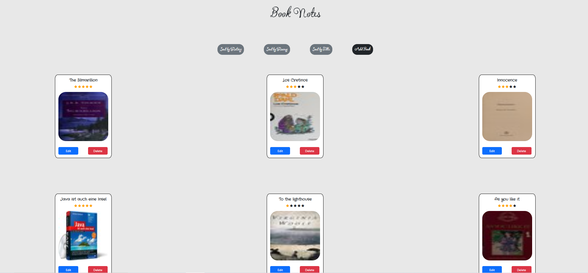

# Book Notes

[]()
[]()
[]()

**Book Notes** is a full-stack web application that allows users to **track books, personal notes, ratings, and reading history**.  
Users can **organize their collection by rating, recency, or title**, and **book cover images** are automatically fetched using the [Open Library Covers API](https://openlibrary.org/dev/docs/api/covers).



---

## Features

- **Add, edit, and delete books** with fields for:

  - Title
  - ISBN
  - Rating
  - Date read
  - Description ("about")
  - Personal notes (citations and comments)

- **View books with cover images** (fetched dynamically by ISBN via Open Library).
- **Sort books** by:
  - Rating (highest first)
  - Recency (most recent first)
  - Title (alphabetically).
- **Edit and manage notes** attached to books (add, update, delete).
- **Backend API** built with Express & PostgreSQL, with routes for book and note CRUD operations.
- **Frontend** uses Express with EJS templates for rendering.

---

## Tech Stack

- **Backend**: Node.js, Express, PostgreSQL (pg)
- **Frontend**: EJS templates, Axios
- **Styling**: Static CSS (in `public/`)
- **Data Fetching**: Open Library Covers API
- **Environment**: dotenv for configuration

---

## Prerequisites

- Node.js (v14+)
- npm or yarn
- PostgreSQL (v12+)

---

## Running the Application

1. **Start the API server**

   ```bash
   node server.js
   ```

   The API will run on [**http://localhost:4000**](http://localhost:4000).

2. **Start the frontend server**

   ```bash
   node index.js
   ```

   The web app will run on [**http://localhost:3000**](http://localhost:3000).

---

## API Endpoints

| Method | Route                | Description                                  |
| ------ | -------------------- | -------------------------------------------- |
| GET    | `/books`             | Retrieve all books                           |
| GET    | `/book/:id`          | Retrieve a single book by ID                 |
| POST   | `/add/book`          | Add a new book (with notes)                  |
| PATCH  | `/edit/book/:id`     | Update book metadata and notes               |
| DELETE | `/delete/book/:id`   | Delete a book and its notes                  |
| GET    | `/note/:bookId`      | Retrieve notes for a specific book           |
| DELETE | `/delete/note/:id`   | Delete a specific note by ID                 |
| GET    | `/sort/book/rating`  | Retrieve books sorted by rating (descending) |
| GET    | `/sort/book/recency` | Retrieve books sorted by date read           |
| GET    | `/sort/book/title`   | Retrieve books sorted by title (A–Z)         |

## Frontend Routes

| Method | Route                          | Purpose                             |
| ------ | ------------------------------ | ----------------------------------- |
| GET    | `/`                            | Homepage (list & sort books)        |
| GET    | `/view/book/:id`               | View detailed book and its notes    |
| GET    | `/add/book`                    | Form to add a new book              |
| POST   | `/submitAdd`                   | Submit new book form                |
| GET    | `/edit/book/:id`               | Form to edit an existing book       |
| POST   | `/submitEdit/:id`              | Submit edited book form             |
| GET    | `/delete/book/:id`             | Delete book and redirect            |
| GET    | `/delete/note/:noteId/:bookId` | Delete note and return to edit form |
| GET    | `/sortby/rating`               | Switch sorting to rating            |
| GET    | `/sortby/recency`              | Switch sorting to recency           |
| GET    | `/sortby/title`                | Switch sorting to title             |
